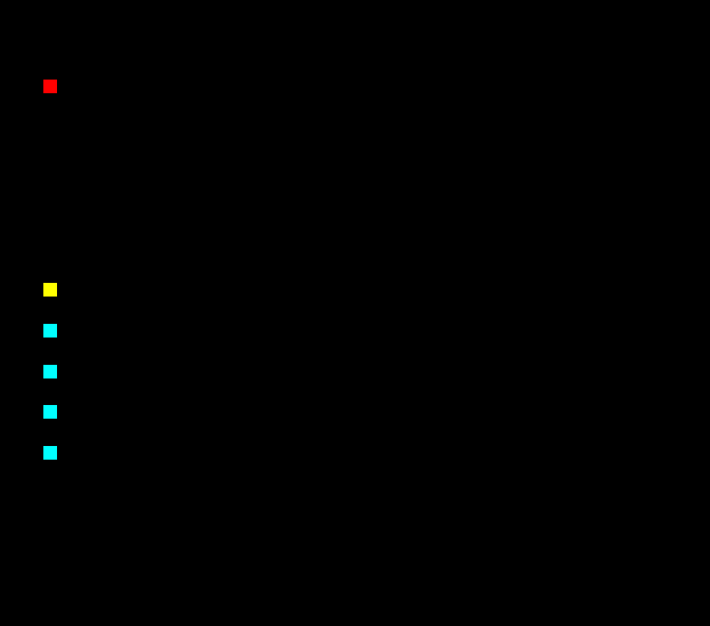

# SnakeAI

## The game

The game is simply made with OpenGL and GLFW, with the game logic done in C++. It is pretty barebones, as it was really just used to debug and visualise the AI's progress.

## The AI

I create a simple artificial neural network in c++. I took the idea for the inputs from [this video](https://www.youtube.com/watch?v=3bhP7zulFfY). There 24 inputs, corresponding to the view in 8 directions from the snake's head, 3 times to look for a wall, the snake's body, and a fruit. There are then 2 hidden layers, one of 16 neuron, the other of 8, using the sigmoid activation function. Four output neurons corresponding to the four choices the player can make. 

Every frame, the AI is given the state of the board, with which it constructs it's 24 inputs, and choses a direction to go to. I initialise 1000 AI players with random weights and biases, and then select the two best players, to create the next generation, adding some randomness for mutations.

## Results

The Ai Players don't really get anywhere close to beating the game, but they do get pretty decent.  

This was after a few minutes of training:

.
